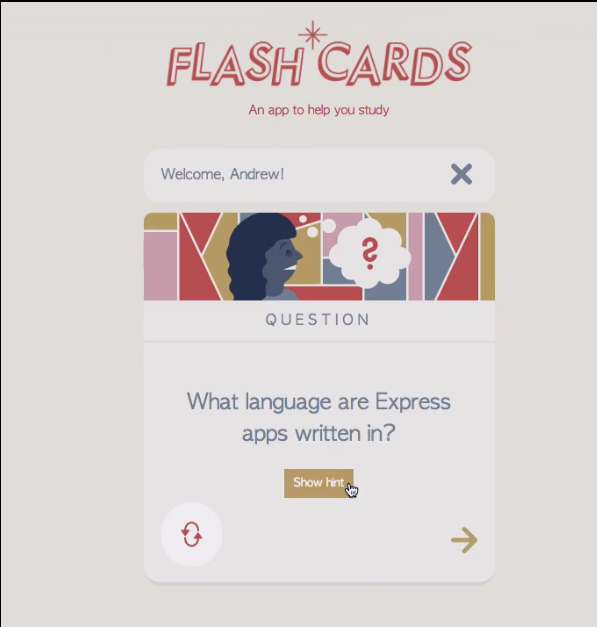

# Express basics 

## Flashcards app



## Getting Started

First install the project dependencies with 

```
npm install
```

And run the app using 

```
node app.js
```

Then browse to the URL 

*http://localhost:3000/*